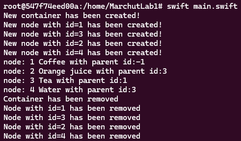

# 🍏 APIOS - Programming for Mobile Apple iOS and MacOS X 📱💻
Repository collects effects of work on exercises from the Programming for Mobile Apple iOS and MacOS X course.

## Exercise Topics

### Exercise 1: 🔍 Developing simple swift console application

In this exercise, we developed a simple console application implementing the Binary Search Tree ((BST))[https://www.programiz.com/dsa/binary-search-tree] data structure. During the class, we focused on implementing methods such as `addNode` and `printBST`. Additionally, we explored how the garbage collector works, carefully examining nodes using `init` and `deinit` methods in two different scenarios:
- Nodes with two children
- Nodes with two children and a reference to their parent

### Exercise 2: 🎮 Wordle clone - macOS app (Cocoa framework)
In this exercise, we developed a simple Wordle clone as a macOS application using the Cocoa framework. We followed Model View Controller (MVC) design pattern, ensuring clear separation of game logic from the user interface.
